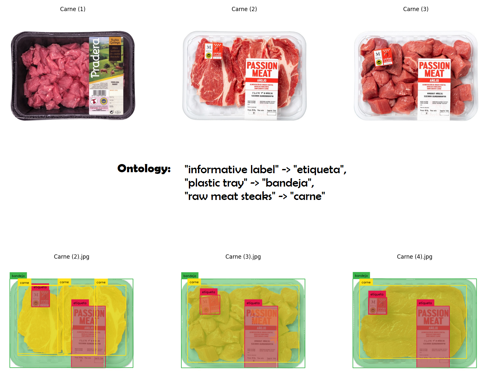

# Autodistill-testing-with-bottles
Este proyecto tiene como objetivo probar una nueva herramienta llamada Autodistill. Autodistill es una herramienta que permite autoanotar imágenes y entrenarlas utilizando un modelo base potente y un modelo objetivo rápido y óptimo.




# Descripción
El proyecto consta de dos scripts principales:

- SAMLabels2Yolov8TargetModel.py: Este script se encarga de la preparación de los datos, la creación de la ontología y la generación del conjunto de datos a través del modelo base.

- Yolov8Training.py: Este script se encarga de realizar el entrenamiento del modelo objetivo y la evaluación del modelo.

- Yolov8Inference.py: Este script se encarga de realizar inferencias utilizando el modelo YOLOv8 entrenado.

# Instalación
Para instalar y configurar este proyecto, necesitarás clonar el repositorio y asegurarte de tener todas las dependencias necesarias instaladas.

# Requisitos
Este proyecto requiere Python 3.7 o superior. Además, se requieren las siguientes bibliotecas, que se pueden instalar con pip utilizando el archivo requirements.txt incluido:

autodistill==0.1.2
autodistill_grounded_sam==0.1.1
autodistill_yolov8==0.1.0
ipython==8.12.2
opencv_python==4.7.0.72
Pillow==9.5.0
supervision==0.9.0
torch==2.0.1+cu117
ultralytics==8.0.81

Para instalar las dependencias, ejecuta el siguiente comando:

```
pip install -r requirements.txt
```

# Uso
Para usar este proyecto, simplemente ejecuta los scripts en el orden indicado anteriormente. Asegúrate de tener tus imágenes en la carpeta correcta y de ajustar cualquier parámetro según sea necesario.

# License

This project is licensed under the Apache License 2.0. For more information, please refer to the [LICENSE](LICENSE) file in the root of this repository.
Apache License 2.0